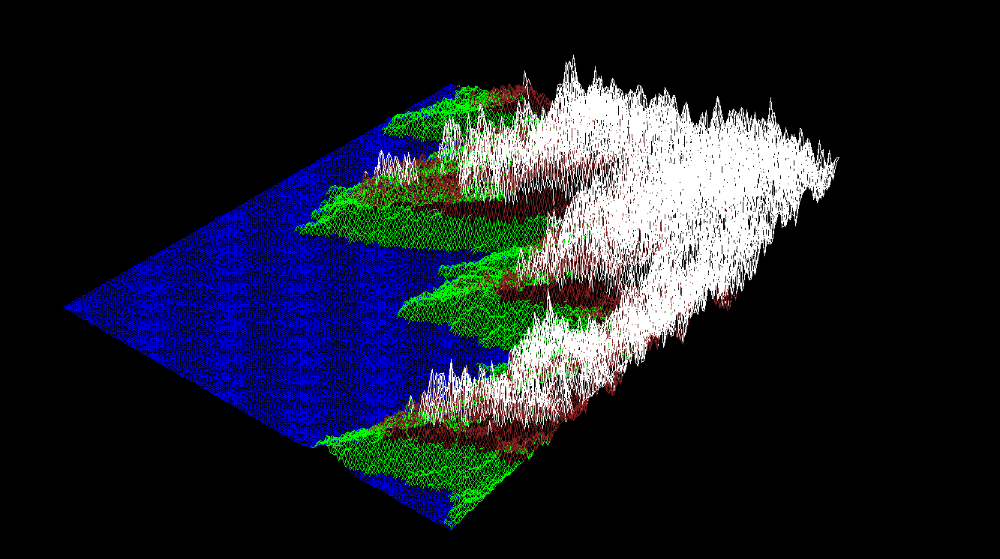

# 🕸️ FdF 

### **42 Cursus — Milestone 2**

---

## 📜 À propos du projet
**FdF** est un projet de moteur de rendu 3D simple. L'objectif est de créer une représentation graphique "fil de fer" (wireframe) d'un relief à partir d'une carte de coordonnées.

🚀 **TLDR** : Le programme lit un fichier `.fdf` contenant des altitudes et génère une vue 3D isométrique en reliant chaque point par des segments de droite, en utilisant la bibliothèque graphique **MiniLibX**.



---

## 🏗️ Architecture & Pipeline Technique

| Étape | Rôle technique |
| :--- | :--- |
| **1. Parsing** | Analyse du fichier source via `get_next_line`. Le programme détermine d'abord les dimensions de la carte avant d'allouer la mémoire et de remplir un tableau de structures `t_point` (x, y, z, couleur). |
| **2. Initialisation Graphique** | Mise en place de l'environnement MiniLibX : établissement de la connexion **X11** (`mlx_init`), création de la fenêtre et configuration d'un **image buffer** (`mlx_new_image`) avec récupération de son adresse (`mlx_get_data_addr`). |
| **3. Projection & Transformation** | Calcul de la position de chaque point dans l'espace. Le programme applique des matrices de **rotation** (X, Y, Z) puis projette les points selon une vue **isométrique** avant d'ajouter les décalages (zoom et shift). |
| **4. Rendu (Bresenham)** | Tracé effectif des lignes entre les points projetés. L'algorithme de **Bresenham** calcule chaque pixel du segment et les écrit directement dans l'adresse mémoire du buffer d'image. |
| **5. Gestion d'événements** | Mise en place des **hooks** pour capturer les entrées utilisateur (clavier, souris) et lancement de la `mlx_loop` qui maintient la fenêtre ouverte et gère les rafraîchissements (`render_loop`). |

---

## 🔷 Partie Mandataire
Le programme répond aux exigences de base du cursus :
* Affichage en **projection isométrique**.
* Gestion propre de la fermeture : touche `ESC` ou clic sur la croix.
* Robustesse face aux fichiers invalides ou protégés.

**Syntaxe :**
`$> ./fdf maps/42.fdf`

---

## 🌟 Partie Bonus

| Action | Touches (keycodes) |
| :--- | :--- |
| **Rotations** | `Q/W` (X), `A/S` (Y), `Z/X` (Z) |
| **Zoom** | `+` (zoom in) / `-` (zoom out) |
| **Translation** | Flèches directionnelles (Haut, Bas, Gauche, Droite) |
| **Altitude** | `C` (accentuer Z) / `V` (aplatir Z) |
| **Projection** | `P` (Switch Isométrique / Parallèle) |
| **Reset** | `R` (Réinitialisation des paramètres par défaut) |

---

## 💡 Exemples d'utilisation

Voici comment tester le rendu avec différentes cartes fournies dans le projet :

* **Afficher le logo 42 :**
    ```bash
    ./fdf maps/42.fdf
    ```
* **Visualiser un relief complexe (ex: La Réunion) :**
    ```bash
    ./fdf maps/t1.fdf
    ```
* **Tester une carte immense (Optimisation) :**
    ```bash
    ./fdf maps/mars.fdf
    ```

---

## 👨‍💻 Mode d'emploi

### 1. Compilation
Le projet nécessite la **MiniLibX** installée sur votre système.
```bash
make          # Compilation standard
make bonus    # Activation des contrôles caméra